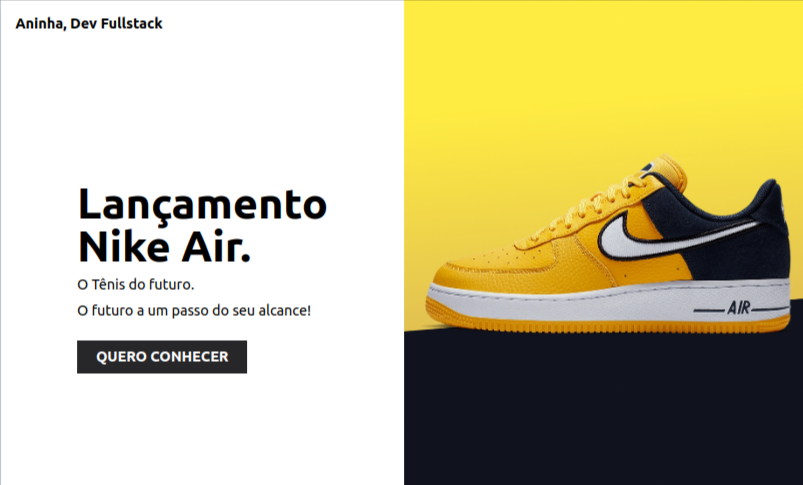

# 👟 Lançamento Nike Air

Projeto de landing page desenvolvido com foco em design moderno, animações com Tailwind CSS, e responsividade para destacar o lançamento do tênis Nike Air.



## 🛠️ Tecnologias Utilizadas

- HTML5
- Tailwind CSS
- JavaScript (básico para interações)
- VS Code como editor principal

---

## 🚀 Como iniciar o projeto no VS Code

1. **Clone o repositório ou extraia o ZIP**  
   Você pode clonar via Git ou extrair o arquivo `.zip`.

2. **Abra o projeto no VS Code**

   No terminal do VS Code:

   ```bash
   cd LancamentoNikeAir

3.  **Instalar as dependencias** 
npm install

4. **Iniciae o servidor de desenvolvimento** 
npm run dev


5. **Abrir o index.html do seu projeto** 
Abrir o index.html no seu projeto pelo Browser ou clicando com o botão direito sob o arquivo e
clicando na extensão Open with Live Server.